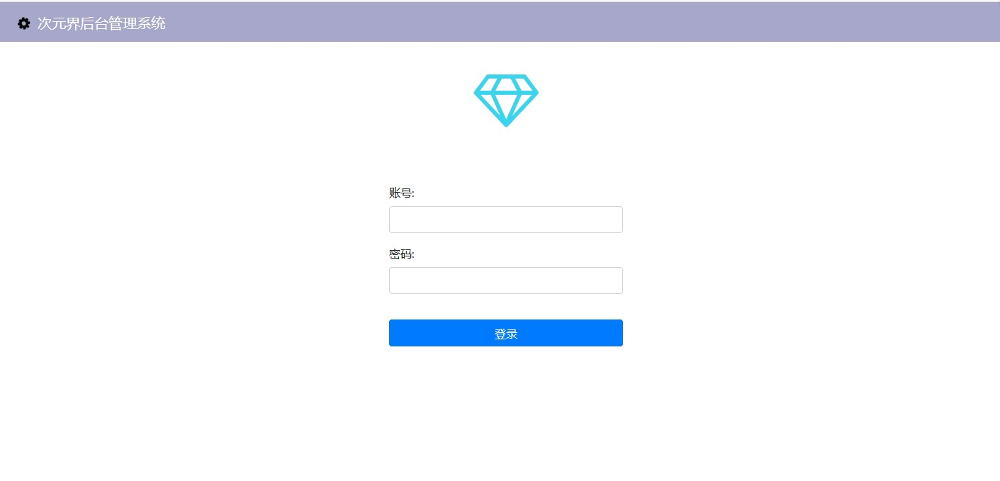
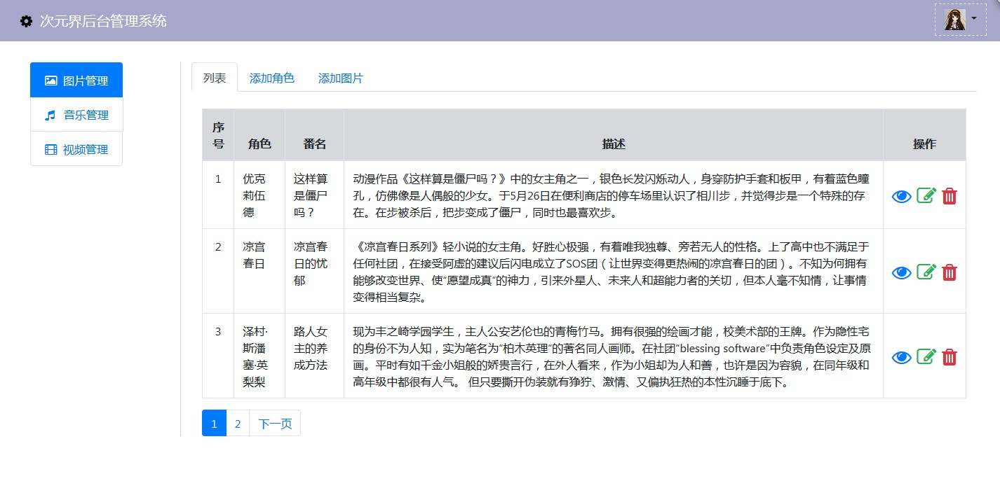
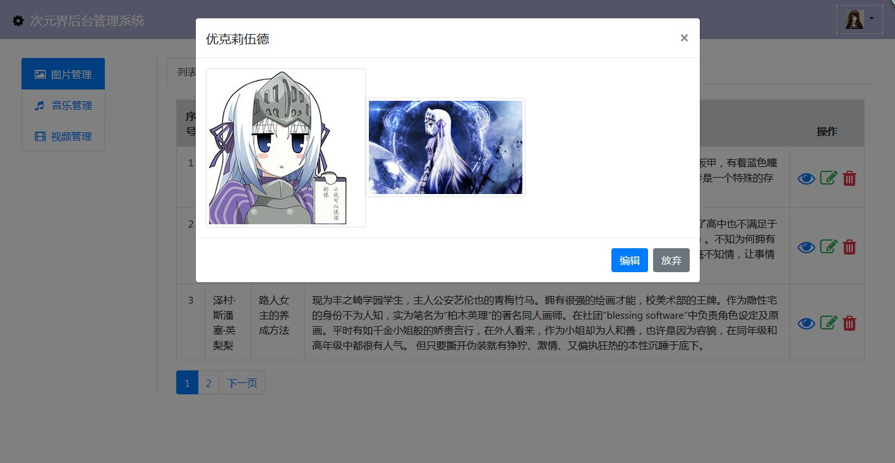

# 这是次元界的后端管理界面

## 技术栈
> jquery + bootstrap4

## 描述
    现在后端模块只是初步写了简单的功能。多人开发有问题。后端需要重构。 后台是用nodejs + koa + mysql 自建分布式文件服务器fastdfs。后台项目暂时停止。等前台项目架构构建好 再来弄后台页面的管理系统。 目前以前端页面和前端后台弄好为主

## 功能介绍

### 图片
>  ---管理图片的增删改查

### 音乐
>  ---管理音乐的增删改查

### 视频
>  ---管理视频的增删改查

## 完成程度

|图片|音乐|视频|
|:---|:---|:---|
|界面完成80% 差图片以懒加载浏览的功能|未开始|未开始|
## 图片模块部分功能展示图
 
 
 